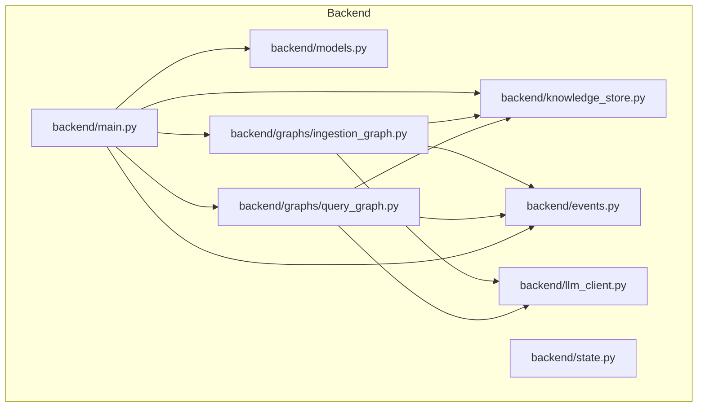
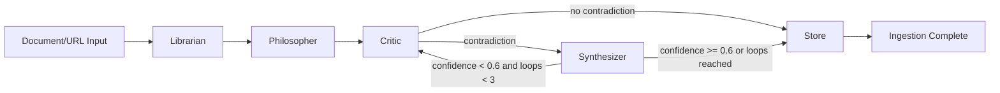
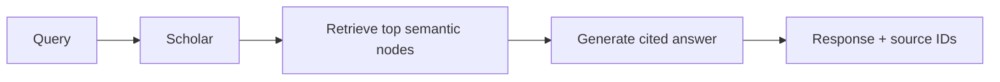
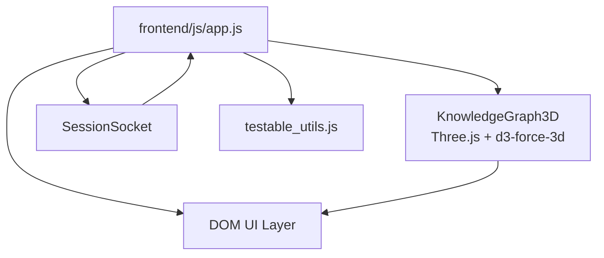
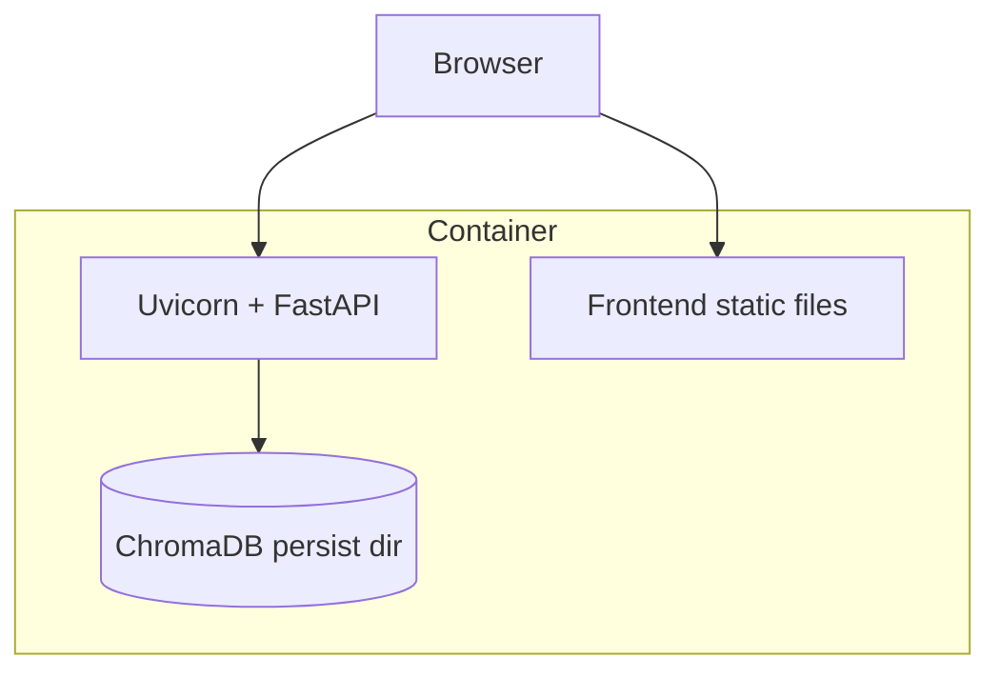

# EchoGraph Architecture

This document describes the system architecture, data flow, runtime components, and deployment model for EchoGraph.

## 1. High-Level System

```mermaid
graph LR
    User[User Browser] --> UI[Frontend UI]\n(HTML/CSS/JS)
    UI --> API[FastAPI Backend]
    UI <--> WS[WebSocket Stream]
    API --> IG[Ingestion Graph\nLangGraph]
    API --> QG[Query Graph\nLangGraph]
    IG --> AGENTS[Agents\nLibrarian/Philosopher/Critic/Synthesizer]
    QG --> SCHOLAR[Scholar Agent]
    AGENTS --> STORE[(ChromaDB)]
    SCHOLAR --> STORE
    WS --> UI
```

## 2. Backend Component Architecture



## 3. Agent Pipeline

### 3.1 Ingestion Pipeline



### 3.2 Query Pipeline



## 4. Frontend Runtime Architecture



## 5. Real-Time Event Protocol

Event envelope:

```json
{
  "event": "concept_extracted",
  "agent": "librarian",
  "data": {"concept": "...", "node_id": "..."},
  "timestamp": "2026-03-06T12:00:00+00:00"
}
```

### Event Delivery Optimizations

- Short-window event batching (`event_batch`)
- Compact encoding for large batches (`event_batch_compact`)
- Replay buffer per session for reconnect-safe continuity

## 6. Knowledge Model

### Node Fields

- `id`
- `concept`
- `summary`
- `source`
- `node_type` (`raw`, `synthesized`, `bridge`)
- `confidence`
- `contradiction_resolved`
- `connected_to[]`
- `relationship_types[]`
- `times_retrieved`
- `created_at`

### Edge Semantics

- `supports`
- `extends`
- `reframes`
- `questions`
- `is_prerequisite_of`
- `bridge`
- `synthesizes`

## 7. Deployment Architecture



- Dockerized backend with Uvicorn workers
- Persistent ChromaDB volume via docker-compose
- Environment-driven configuration (`.env`)

## 8. Reliability and Safety Controls

- Input sanitization and validation (Pydantic + text normalization)
- Endpoint-specific rate limiting with headers
- Structured logging + rotating file logs
- Graceful error mapping in backend and frontend
- Demo mode with seeded data and ingestion lock when API key is absent

## 9. Performance Strategy

- Batch embedding calls for concept extraction
- Embedding cache for repeated content
- d3-force-3d physics with collision force
- Hybrid node rendering path with instanced mode for large graphs
- LOD and frustum-aware visibility updates
- Capped/reused particle stream pool
