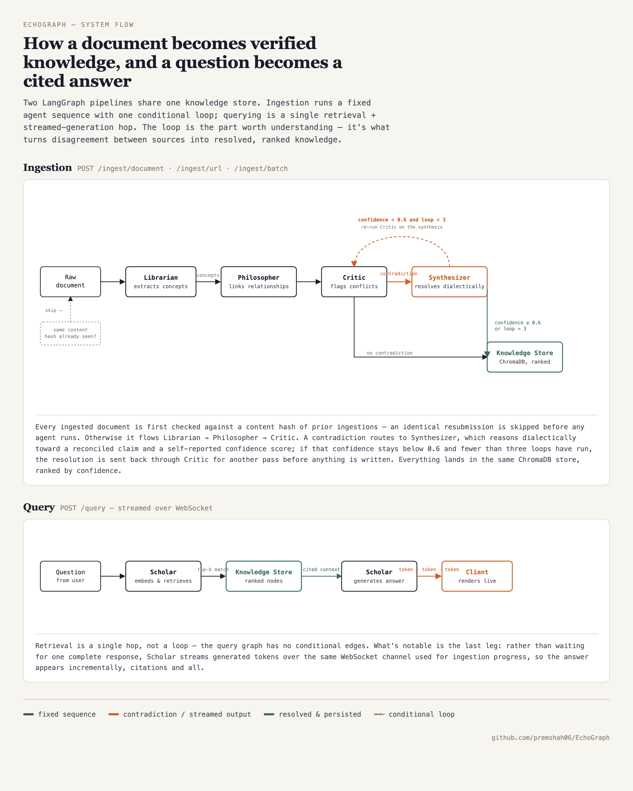

# EchoGraph

EchoGraph is a multi-agent living knowledge base that ingests content, detects contradictions, synthesizes higher-confidence knowledge, and answers questions with source citations.



## What You Get

### Core Architecture

- FastAPI backend with LangGraph orchestration (ingestion graph + query graph)
- Five agents: Librarian, Philosopher, Critic, Synthesizer, Scholar — with a confidence-gated Critic ↔ Synthesizer contradiction-resolution loop
- ChromaDB persistent semantic storage
- Real-time WebSocket event stream with batching/compaction/replay
- Demo mode with pre-seeded sample graph when no OpenAI key is configured

### Agentic Engineering

- **Evaluation harness** (`backend/eval/`) — runs golden documents through the real ingestion/query pipelines and scores concept recall, contradiction detection, and confidence calibration against labeled expectations (`python -m backend.eval.run`)
- **Multi-model cost router** (`backend/optimization/`) — routes each agent to the cheapest model that meets its complexity needs, with payload compression, prompt caching, and per-call cost tracking surfaced via `GET /graph/stats`. Measured **94.9% cost savings** vs. an unrouted gpt-4o baseline on a real ingestion + query run (see `docs/features.md` #3 for the full measurement and two bugs found while verifying it)
- **Provenance ledger** — every synthesized node records its full derivation chain (source nodes, the contradiction Critic flagged, Synthesizer's reasoning, resolution loop iteration), queryable via `GET /graph/nodes/{id}/provenance` and viewable as a "why does the graph believe this?" trace in the UI
- **Token-level streaming** — Scholar's query answers stream live over the WebSocket as they generate, instead of waiting for one complete response
- **Idempotent ingestion** — content-hash deduplication on `/ingest/*` skips re-processing identical documents, returning the original result with zero extra LLM calls

See [docs/features.md](docs/features.md) for the full feature backlog and design notes behind each of the above.

### Frontend & Visualization

- Three.js + d3-force-3d knowledge graph visualization
- Search with graph focus, contradiction highlighter, node path tracing, confidence threshold filter
- Agent pipeline visualizer — live drawer timeline of each agent's decisions during ingestion
- Node inspector — confidence score, source, connections, which agents touched each node, and provenance trace for synthesized nodes
- Ingest history panel, query history panel (persisted in localStorage), source credibility breakdown in Stats
- Graph JSON export (`GET /graph/export`), individual node deletion with automatic edge cleanup

### Production & Ops

- Structured JSON logging with per-request correlation IDs (`X-Request-ID`)
- Real `/health` checks — pings ChromaDB and verifies the agent graphs compiled, returns 503 on a degraded dependency
- API key auth (`X-API-Key`) on all graph endpoints when `API_KEYS` is configured
- Docker production hardening — `HEALTHCHECK`, CPU/memory resource limits, configurable `LOG_LEVEL`/`WORKERS`

## Architecture Docs

- System flow diagram (shown above) — source: [docs/architecture/flow-diagram-export.html](docs/architecture/flow-diagram-export.html)
- Full architecture and diagrams: [ARCHITECTURE.md](ARCHITECTURE.md)
- Hand-drawn component diagram (regenerate with `/update-architecture-diagram`): [docs/architecture/diagram.html](docs/architecture/diagram.html)
- API reference: [docs/api.md](docs/api.md)
- Developer guide: [docs/developer-guide.md](docs/developer-guide.md)
- Feature backlog and design notes: [docs/features.md](docs/features.md)

## Prerequisites

- Python 3.10+
- Node.js 20+ (for frontend test harness)
- OpenAI API key (optional; without it, app runs in demo mode)

## Local Run (Development)

1. Create virtualenv and install Python dependencies.

```bash
python3 -m venv .venv
source .venv/bin/activate
pip install -r requirements.txt
```

2. Configure environment.

```bash
cp .env.example .env
```

3. Start backend.

```bash
uvicorn backend.main:app --host 0.0.0.0 --port 8000 --reload
```

4. Open UI.

- `http://localhost:8000/frontend`

## Docker Run

```bash
docker compose up --build
```

- API/UI served on `http://localhost:8000`
- Chroma persistence via `chroma_data` volume

## Environment Variables

- `OPENAI_API_KEY`: OpenAI API key
- `HOST`: server host (default `0.0.0.0`)
- `PORT`: server port (default `8000`)
- `CHROMADB_PERSIST_DIR`: storage directory
- `ALLOWED_ORIGINS`: comma-separated CORS origins
- `DEMO_MODE`: `true/false`
- `API_KEYS`: comma-separated keys; when set, all graph endpoints (`/ingest/*`, `/query`, `/graph/nodes`, `/graph/stats`, `/graph/export`, `/graph/reset`) require an `X-API-Key` header matching one of them (auth disabled if empty)
- `LOG_LEVEL`: logging verbosity — `DEBUG`, `INFO` (default), `WARNING`, `ERROR`
- `WORKERS`: number of uvicorn worker processes (default `2`)
- `ENABLE_TOKEN_OPTIMIZER`: `true/false` (default `true`) — routes agent calls through the cost-optimized multi-model client; falls back to a plain client when `false` or in demo mode

## Testing

### Frontend Test Harness

```bash
npm run test:frontend
```

This runs static/runtime contract tests for:

- 3D graph runtime contracts
- node/edge operations
- interaction bindings
- WebSocket handler coverage
- UI structure and utility behavior

### Python Tests

```bash
pytest -q
```

### Agent Evaluation Harness

```bash
python -m backend.eval.run
```

Runs golden fixtures through the real ingestion/query pipelines and prints a scorecard. Requires `OPENAI_API_KEY` to evaluate real reasoning quality — without it, results are labeled "smoke test only" (validates wiring, not correctness).

## Common Workflows

### Ingest Document

```bash
curl -X POST http://localhost:8000/ingest/document \
  -H "Content-Type: application/json" \
  -d '{"content":"Transformers are sequence models...","source_label":"nlp-notes.txt"}'
```

### Ingest URL

```bash
curl -X POST http://localhost:8000/ingest/url \
  -H "Content-Type: application/json" \
  -d '{"url":"https://example.com/article"}'
```

### Query

```bash
curl -X POST http://localhost:8000/query \
  -H "Content-Type: application/json" \
  -d '{"query":"What contradictions were found?"}'
```

## Demo Mode Behavior

If `OPENAI_API_KEY` is missing or demo mode is enabled:

- Sample graph data is auto-seeded
- Ingestion endpoints are disabled
- Query, graph visualization, and event UI remain available

## Project Layout

```
backend/
  agents/                    Librarian, Philosopher, Critic, Synthesizer, Scholar — one LLM-driven node each
  graphs/                    LangGraph wiring: ingestion_graph.py, query_graph.py
  eval/                      Evaluation harness — golden fixtures, headless runner, scorer, CLI
  optimization/              Multi-model cost router — compression, caching, routing, cost metrics
  main.py                    FastAPI app, REST endpoints, WebSocket connection manager
  knowledge_store.py         ChromaDB persistence — graph nodes + ingestion-hash dedup table
  llm_client.py              OpenAI client wrappers (demo / plain / streaming), selected by config
  events.py                  Structured agent event emission (emit_event / build_event)
  state.py                   Shared LangGraph state schema (EchoState)
  config.py                  Environment-driven settings
  retry.py                   Error-classified retry/backoff for LLM calls

frontend/
  index.html                 App shell
  js/app.js                  UI logic, WebSocket client, graph rendering glue
  js/testable_utils.js       Pure functions covered by the frontend test harness
  css/style.css              Styling

tests/
  unit/                      Fast, isolated tests (agents, knowledge store, optimization, retry, eval)
  integration/               API endpoint contracts, full graph wiring, WebSocket manager
  frontend/                  Node-based contract tests for frontend/js/*
  performance/               Load/latency checks
  uat/                       User-acceptance scenarios

docs/
  api.md                     API reference
  developer-guide.md         Developer onboarding
  features.md                Feature backlog with design rationale per feature
  portfolio-notes.md         Engineering decisions worth resume/interview framing
  architecture.yaml          Source of truth for the architecture diagram
  architecture/diagram.html  Rendered diagram (regenerate via /update-architecture-diagram)
```

`docs/features.md` is the actively maintained feature backlog and design log.
