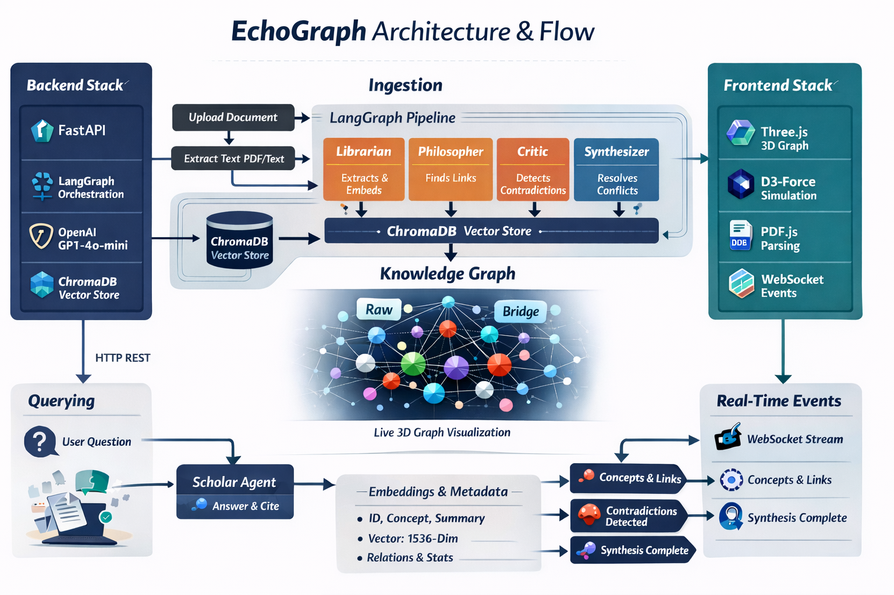

# EchoGraph


EchoGraph is a multi-agent living knowledge base that ingests content, detects contradictions, synthesizes higher-confidence knowledge, and answers questions with source citations.

## What You Get

- FastAPI backend with LangGraph orchestration
- ChromaDB persistent semantic storage
- Five agents: Librarian, Philosopher, Critic, Synthesizer, Scholar
- Real-time WebSocket event stream with batching/compaction/replay
- Responsive white/light frontend with Three.js + d3-force-3d visualization
- Demo mode with pre-seeded sample graph when OpenAI key is unavailable



## Architecture Docs

- Full architecture and diagrams: [ARCHITECTURE.md](ARCHITECTURE.md)
- API reference: [docs/api.md](docs/api.md)
- Developer guide: [docs/developer-guide.md](docs/developer-guide.md)

## Prerequisites

- Python 3.10+
- Node.js 20+ (for frontend test harness)
- OpenAI API key (optional; without it, app runs in demo mode)

## Local Run (Development)

1. Create virtualenv and install Python dependencies.

```bash
python3 -m venv .venv
source .venv/bin/activate
pip install -r requirements.txt
```

2. Configure environment.

```bash
cp .env.example .env
```

3. Start backend.

```bash
uvicorn backend.main:app --host 0.0.0.0 --port 8000 --reload
```

4. Open UI.

- `http://localhost:8000/frontend`

## Docker Run

```bash
docker compose up --build
```

- API/UI served on `http://localhost:8000`
- Chroma persistence via `chroma_data` volume

## Environment Variables

- `OPENAI_API_KEY`: OpenAI API key
- `HOST`: server host (default `0.0.0.0`)
- `PORT`: server port (default `8000`)
- `CHROMADB_PERSIST_DIR`: storage directory
- `ALLOWED_ORIGINS`: comma-separated CORS origins
- `DEMO_MODE`: `true/false`

## Testing

### Frontend Test Harness

```bash
npm run test:frontend
```

This runs static/runtime contract tests for:

- 3D graph runtime contracts
- node/edge operations
- interaction bindings
- WebSocket handler coverage
- UI structure and utility behavior

### Python Tests

```bash
pytest -q
```

## Common Workflows

### Ingest Document

```bash
curl -X POST http://localhost:8000/ingest/document \
  -H "Content-Type: application/json" \
  -d '{"content":"Transformers are sequence models...","source_label":"nlp-notes.txt"}'
```

### Ingest URL

```bash
curl -X POST http://localhost:8000/ingest/url \
  -H "Content-Type: application/json" \
  -d '{"url":"https://example.com/article"}'
```

### Query

```bash
curl -X POST http://localhost:8000/query \
  -H "Content-Type: application/json" \
  -d '{"query":"What contradictions were found?"}'
```

## Demo Mode Behavior

If `OPENAI_API_KEY` is missing or demo mode is enabled:

- Sample graph data is auto-seeded
- Ingestion endpoints are disabled
- Query, graph visualization, and event UI remain available

## Project Layout

- `backend/`: API, graph orchestration, agents, storage, events
- `frontend/`: UI, rendering engine, WebSocket client
- `tests/`: unit, integration, frontend harness tests
- `docs/`: API + developer docs
- `.kiro/specs/echosystem-multi-agent-kb/tasks.md`: implementation checklist
